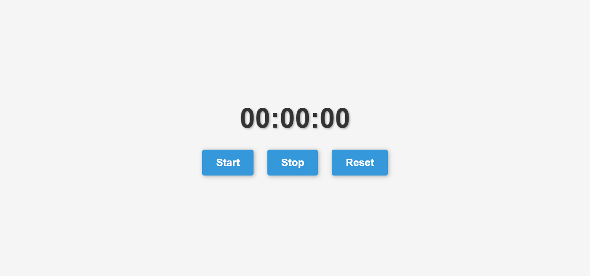

# Stopwatch App

A simple stopwatch application with start, stop, and reset functionality. This application is built using HTML, CSS, and JavaScript.

## Screenshot



## Features

- **Start Button:** Initiates the stopwatch, tracking elapsed time.
- **Stop Button:** Pauses the stopwatch.
- **Reset Button:** Resets the stopwatch to 00:00:00.

## Getting Started

1. Clone the repository:

    ```bash
    git clone https://github.com/MohcineSafi/stopwatch-app.git
    ```

2. Open the `index.html` file in your web browser.

## Usage

- Click the **Start** button to begin the stopwatch.
- Click the **Stop** button to pause the stopwatch.
- Click the **Reset** button to reset the stopwatch to 00:00:00.

## Contributing

If you'd like to contribute to this project, follow these steps:

1. Fork the repository.
2. Create a new branch: `git checkout -b feature/my-feature`.
3. Make your changes and commit them: `git commit -m 'Add some feature'`.
4. Push to the branch: `git push origin feature/my-feature`.
5. Submit a pull request.

## License

This project is licensed under the MIT License.

## Author

Feel free to customize this readme file according to your needs.